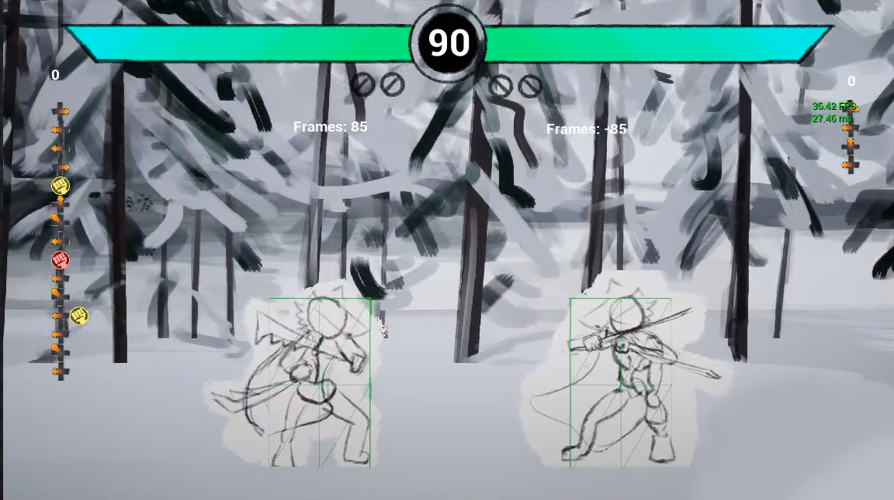

# Game Dev Projects

A portfolio of game projects from both personal work and school

## Untitled Fighting Game - Lead Developer, Designer and Artist

A traditional 2D fighting game intended as a self-learning opportunity and a platform to explore fighting game ideas

- All programming, design, and art is done by me!
- Ongoing work to integrate GGPO, a rollback network library specifically designed for fighting games
- https://github.com/chunloklo/Unreal2DFighter

## Three Days To Launchpad - Lead Game Programmer, Designer

A top-down wave defense game played with a custom built slingshot controller.

- Built with a multi-disciplinary team of 4 members in two months for the Interactive Product Design course
- Implemented game systems in Java
- Designed game mechanics with other team members
- Programmed an Arduino to read controller sensor and mapped signals to in-game controls
- https://github.com/chunloklo/three-days-to-launchpad

## Tower of Tears – Gameplay and Design Lead

A third person puzzle adventure game about rotating platforms around a central tower

- Developed with a team of 4 developers over 2 months for a game development course
- Managed work for the team and integrated individual technical contributions
- Implemented the core rotation system
- Designed 2 different levels and a boss fight level for the game
- Developed in Unity
- https://github.com/chunloklo/tower-of-tears

## Kronos Island – Gameplay and Design Lead

- A time-slowing FPS built in 48 hours for HackGT 2017 in a team of 2 developers

- Implemented the core time-slow and shooting mechanic
- Designed 2 basic levels for the game
- Developed in Unity
- https://github.com/chunloklo/Kronos-Island

**Touhou Tribute GBA Game**

A shoot’em up tribute to the Touhou series for the Gameboy Advanced 

- Worked around the limitations of the GBA's limited memory and processing power
- https://github.com/chunloklo/THou

