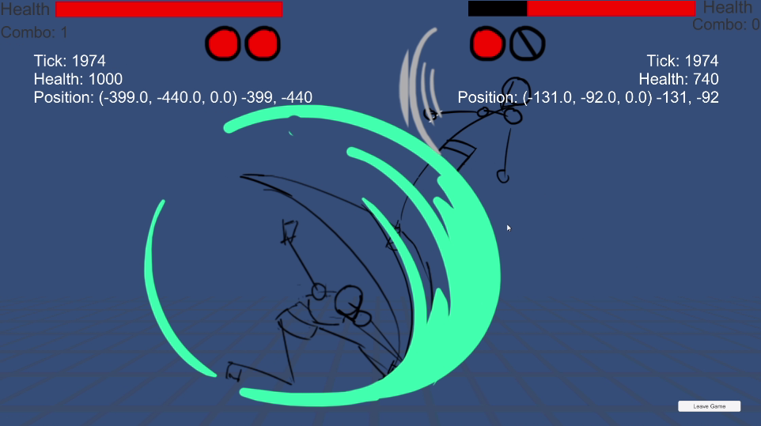
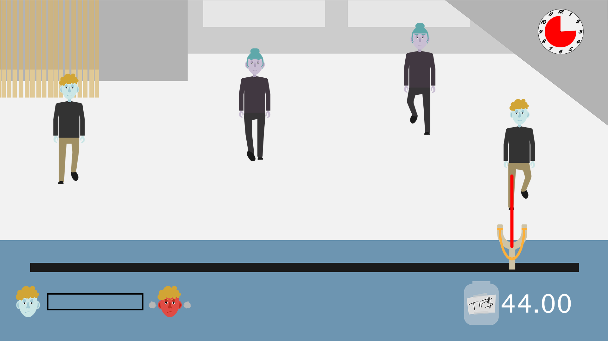
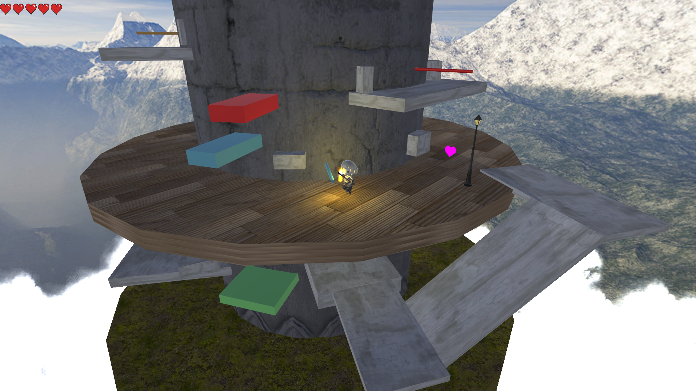
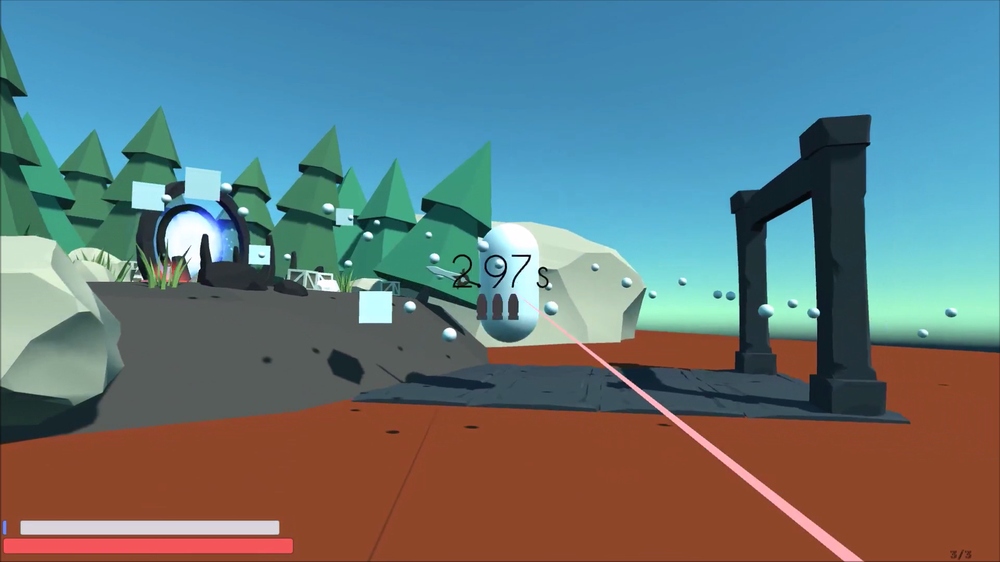
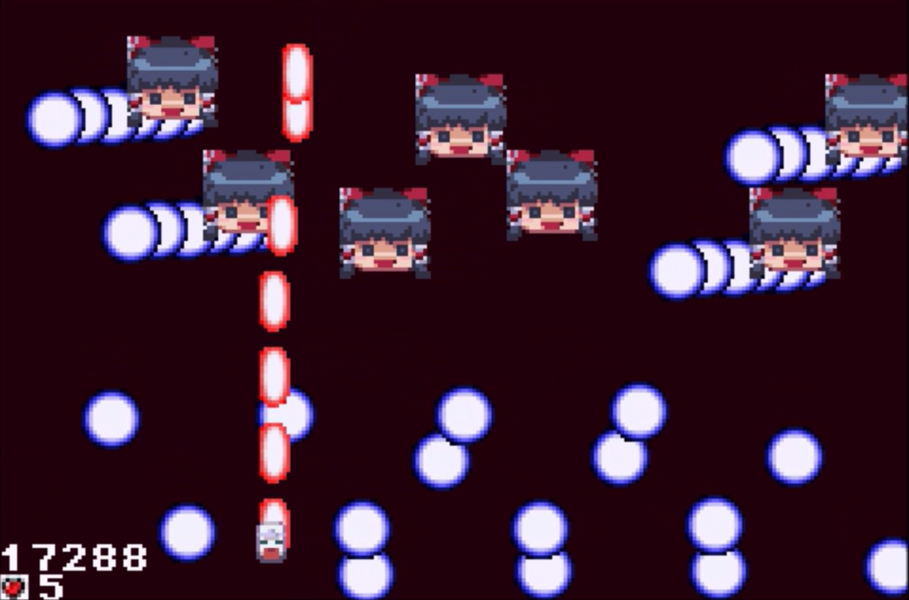

# Game Dev Projects

A portfolio of game projects from both personal work and school

## Untitled Fighting Game - Solo Developer

A 2D fighting game intended as a self-learning opportunity and a platform to explore fighting game design ideas.

This game is being developed in Unity with rollback netcode and Steam integration.

- Responsible for all programming, art, and design
- Developed in Unity and C#
- Playtest Video: [link](https://www.youtube.com/watch?v=PNFkTmTP0ak)

## Three Days To Launchpad - Lead Game Programmer and Designer

A top-down wave defense game played with a custom built slingshot controller

- Built with a multi-disciplinary team of 4 members in two months for the Interactive Product Design course
- Implemented game systems in Java
- Designed game mechanics with other team members
- Programmed an Arduino to read controller sensor and mapped signals to in-game controls
- https://github.com/chunloklo/three-days-to-launchpad
- Video Demo: [link](https://www.youtube.com/watch?v=xDo9BJ58l6I)

## Tower of Tears – Gameplay/Design Lead

A third person puzzle adventure game about rotating platforms around a central tower

- Developed with a team of 4 developers over 2 months for a game development course
- Managed work for the team and integrated individual technical contributions
- Implemented the core rotation system
- Designed the core tower rotation mechanic, 2 different levels, and a final boss fight for the game
- Developed in Unity
- https://github.com/chunloklo/tower-of-tears
- Video Demo: [link](https://www.youtube.com/watch?v=SCLiuirV4eI)

## Kronos Island – Gameplay/Design Lead

A time-slowing FPS built in 48 hours for HackGT 2017 in a team of 2 developers

- Implemented the core time-slow and shooting mechanic
- Designed 2 basic levels for the game
- Developed in Unity
- https://github.com/chunloklo/Kronos-Island
- Video Demo: [link](https://www.youtube.com/watch?v=gEn0SKiARRY)

## Touhou Tribute GBA Game - Developer/Designer

A shoot’em up tribute to the Touhou series for the GameBoy Advanced 

- Worked around the limitations of the GBA's limited memory and processing power
- https://github.com/chunloklo/THou
- Video Demo: [link](https://www.youtube.com/watch?v=3EM-_SlTtWo)

